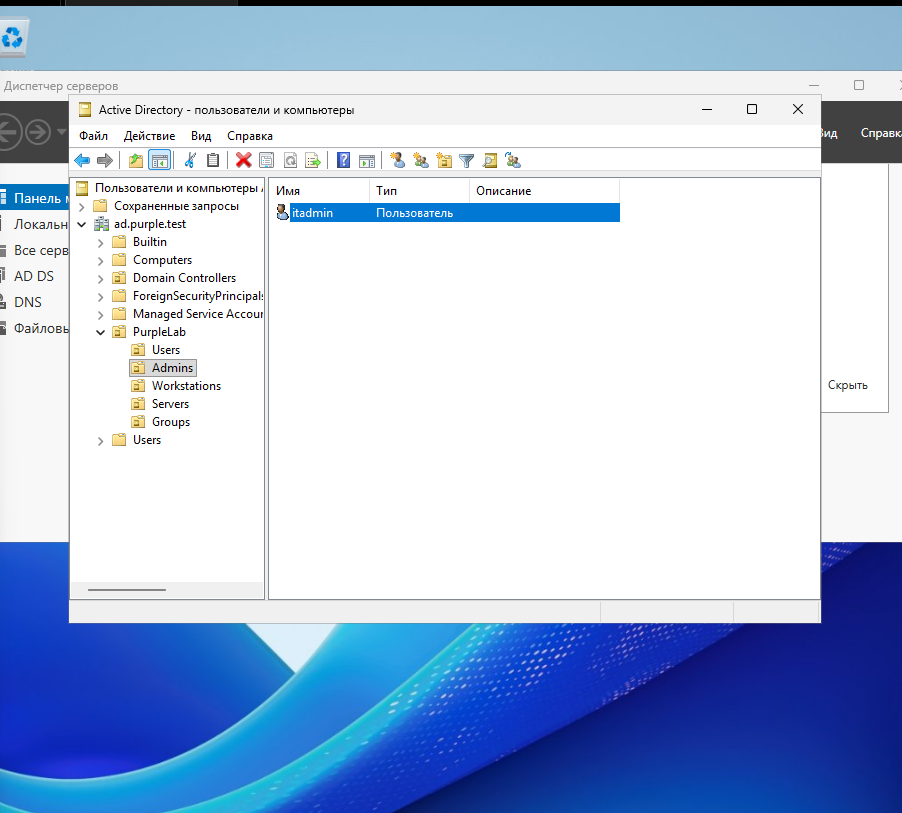

# Purple Team Active Directory Lab

This project documents the creation of a Purple Team laboratory
for adversary emulation, detection engineering and incident investigation.

## Goals

- Build an Active Directory environment
- Collect Windows security telemetry
- Simulate attacker techniques
- Map attacks to MITRE ATT&CK
- Develop detection rules
- Investigate generated alerts
- Document detection gaps
- Retest detections

## Lab Architecture

| Host | Operating System | Purpose |
|------|------------------|---------|
| DC01 | Windows Server | Active Directory Domain Controller |
| WS01 | Windows 11 | Domain workstation |
| ATTACK01 | Kali Linux | Adversary simulation |
| SIEM01 | Ubuntu Linux | Wazuh SIEM |

## Current Progress

- [x] Windows Server installed
- [x] DC01 configured
- [x] Active Directory deployed
- [x] Domain created: ad.purple.test
- [x] Organizational Units created
- [x] Test users created
- [x] Security groups created
- [x] Domain admin account created
- [x] Windows 11 workstation deployed
- [x] WS01 joined to ad.purple.test
- [x] Domain logon verified with alice
- [x] WS01 moved to Workstations OU

## Documentation

- [Active Directory Setup](docs/active-directory-setup.md)
- [Windows Workstation Setup](docs/workstation-setup.md)
