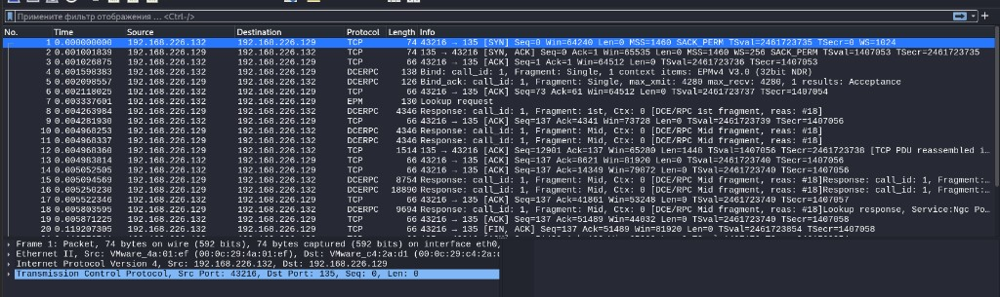
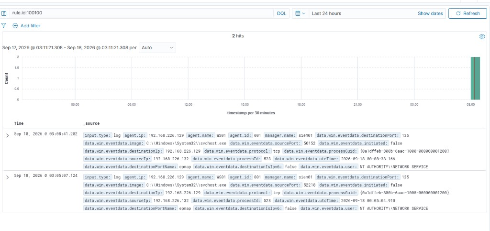

# Detection Report: RPC Reconnaissance

## Objective

Detect inbound RPC Endpoint Mapper reconnaissance against the domain workstation `WS01` and validate that Sysmon network telemetry can be turned into a useful SIEM alert.

This exercise covers the first Attack → Telemetry → Detection → Alert loop in the Purple Team lab.

## Lab Hosts

| Host | Role | IP | Notes |
|------|------|----|-------|
| WS01 | Target / Wazuh agent | `192.168.226.129` | Domain workstation, Sysmon enabled |
| SIEM01 | Wazuh all-in-one | `192.168.226.20` | Manager / Indexer / Dashboard |
| ATTACK01 | Attacker / recon source | `192.168.226.132` | Kali Linux, RPC enumeration source |
| DC01 | Domain Controller | `192.168.226.10` | Not the detection target in this scenario |

Domain: `ad.purple.test`

## Attack Command

RPC Endpoint Mapper enumeration was performed from ATTACK01:

```bash
impacket-rpcdump 192.168.226.129
```

An initial TCP/135 service probe was also performed with Nmap:

```bash
nmap -sV -Pn -p 135 192.168.226.129
```

Purpose:

- enumerate RPC Endpoint Mapper interfaces/endpoints
- generate inbound RPC telemetry on WS01
- validate endpoint and SIEM detection coverage

Run on: ATTACK01 (`192.168.226.132`)

## Wireshark Evidence

Packet capture confirmed RPC Endpoint Mapper enumeration from ATTACK01 (`192.168.226.132`) to WS01 (`192.168.226.129`) over TCP/135.

Observed sequence:

- TCP three-way handshake
- DCE/RPC Bind
- DCE/RPC Bind ACK
- EPM Lookup Request
- Multiple DCE/RPC responses
- TCP session termination

This network capture confirms that actual RPC Endpoint Mapper enumeration occurred, not just a TCP/135 connection attempt.



## Sysmon Event ID 3

Sysmon recorded the network connection as:

- Event ID: `3`
- Event Type: Network connection
- Destination port: `135`
- Destination port name: `epmap`
- Protocol: TCP
- Image: `C:\Windows\System32\svchost.exe`
- User: `NT AUTHORITY\NETWORK SERVICE`
- Initiated: `false` (inbound connection)

Observed source/destination pair:

- Source IP: ATTACK01 (`192.168.226.132`)
- Destination IP: WS01 (`192.168.226.129`)

This is valuable because inbound RPC mapping activity is visible even when the listening process is a legitimate system service.

## Evidence Layers

These layers answer different questions and should not be treated as equivalent:

- **Wireshark** proves that RPC Endpoint Mapper enumeration actually occurred on the network.
- **Sysmon Event ID 3** proves that WS01 observed an inbound TCP/135 connection from ATTACK01.
- **Wazuh rule `100100`** turns that endpoint telemetry into a level `8` alert.

Important: Wazuh rule `100100` by itself does **not** prove EPM Lookup. It detects an inbound connection from `192.168.226.132` to TCP/135. The fact of RPC enumeration is confirmed by the Wireshark packet capture.

## Wazuh Rule 100100

A custom Wazuh detection rule was created:

- Rule ID: `100100`
- Rule level: `8`
- Purpose: alert on Sysmon network connection telemetry related to RPC Endpoint Mapper recon against WS01 from ATTACK01

The rule consumes Sysmon Event ID 3 fields such as:

- destination port `135`
- destination IP / agent context
- source IP
- process image / user context when available

## Alert Evidence

The alert was verified in Wazuh Dashboard with query:

```text
rule.id:100100
```

Result:

| Field | Value |
|-------|-------|
| `rule.id` | `100100` |
| `rule.level` | `8` |
| Agent name | `WS01` |
| Agent ID | `001` |
| `sourceIp` | `192.168.226.132` (ATTACK01) |
| `destinationIp` | `192.168.226.129` (WS01) |
| `destinationPort` | `135` |
| `protocol` | `tcp` |
| `image` | `C:\Windows\System32\svchost.exe` |
| `user` | `NT AUTHORITY\NETWORK SERVICE` |
| `initiated` | `false` |

`initiated: false` confirms that the connection was inbound from the WS01 perspective.

Evidence screenshot:



## Limitations / False Positives

Current rule `100100` is a **v1 lab-specific** detection and is tied to the specific ATTACK01 source IP `192.168.226.132`.

It is suitable for validating the detection pipeline, but it is **not** a production-ready detection.

Additional limitations:

- Legitimate Windows / AD management traffic may also use RPC Endpoint Mapper (`TCP/135`)
- Alerting only on destination port `135` can produce noise in denser environments
- `svchost.exe` under `NETWORK SERVICE` is expected for many normal RPC services
- The current rule proves telemetry and alerting work; it is not yet a complete hunting playbook

Future versions should:

- not depend on one hardcoded source IP
- consider frequency / burst behavior
- account for trusted admin hosts
- optionally correlate multiple RPC connections
- reduce false positives

## MITRE ATT&CK Mapping

| Field | Value |
|-------|-------|
| Tactic | Discovery |
| Technique | Network Service Discovery |
| Technique ID | [T1046](https://attack.mitre.org/techniques/T1046/) |
| Related activity | RPC Endpoint Mapper reconnaissance over TCP/135 |

This maps cleanly to early-stage adversary recon before credential access or lateral movement.

## Lessons Learned

- Sysmon Event ID 3 is enough to detect inbound RPC recon when forwarded to Wazuh
- Custom rule `100100` successfully closed the Attack → Detect loop for this scenario
- Detection quality depends on context: port `135` alone is weak without source/baseline tuning
- Evidence collection should include packet capture, endpoint telemetry and SIEM alert screenshots together
- This scenario demonstrated the difference between packet-level evidence, endpoint telemetry, and SIEM detection:
  - **Wireshark** — actual RPC protocol activity
  - **Sysmon** — endpoint network connection telemetry
  - **Wazuh** — alerting and detection logic
- Next improvements: reduce false positives, document exact Sigma/Wazuh rule logic in-repo, and expand to follow-on RPC enumeration techniques

## Status

**Done** — first detection engineering scenario validated end-to-end in the lab.
