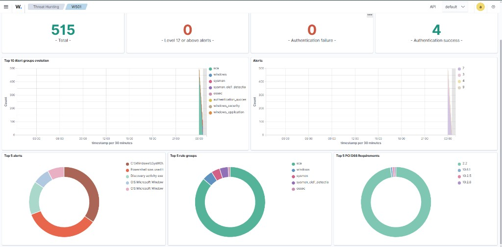

# Wazuh Setup

## Overview

Wazuh was deployed as the SIEM platform for the Purple Team lab to collect, normalize and review endpoint telemetry from the domain workstation `WS01`.

| Component | Value |
|---|---|
| Host | SIEM01 |
| IP address | `192.168.226.20` |
| Operating System | Ubuntu Server 24.04 |
| Deployment | Wazuh all-in-one |
| Agent | WS01 |
| Domain | ad.purple.test |

## SIEM Host

SIEM01 runs Ubuntu Server 24.04 and hosts a Wazuh all-in-one installation, including the manager, indexer and dashboard components on a single host.

## Agent Enrollment

The domain workstation `WS01` was enrolled as a Wazuh agent and connected successfully to the manager on SIEM01.

## Architecture

```text
WS01
  │
  │ Wazuh Agent
  │ Sysmon telemetry
  ▼
SIEM01
  ├── Wazuh Manager
  ├── Wazuh Indexer
  └── Wazuh Dashboard
```

## Sysmon Log Collection

The following Windows event channel is forwarded from WS01 to Wazuh:

`Microsoft-Windows-Sysmon/Operational`

## Verification

Sysmon Event ID 1 telemetry from WS01 is visible in the Wazuh Dashboard.

This confirms that:

- the Wazuh agent on WS01 is connected
- the Sysmon Operational channel is being collected
- process creation events are reaching the SIEM

The following telemetry was verified in the dashboard:

- Sysmon Event ID 1 — Process Create
- Process image and command line
- Parent process information
- User context
- Process hashes

## Evidence



## Detection Validation

The first custom detection scenario was validated end-to-end:

| Field | Value |
|-------|-------|
| Attacker | ATTACK01 (`192.168.226.132`) |
| Target | WS01 (`192.168.226.129`) |
| Telemetry | Sysmon Event ID 3 |
| Destination | TCP/`135` |
| Custom rule | `100100` |
| Rule level | `8` |
| MITRE ATT&CK | T1046 Network Service Discovery |
| Result | Detection visible in Threat Hunting |

Full write-up:

[RPC Reconnaissance Detection Report](detections/rpc-reconnaissance.md)


## Troubleshooting

During agent deployment, WS01 initially connected to an incorrect manager address:

`192.162.226.20`

The issue was identified through the Wazuh agent log and corrected in:

`C:\Program Files (x86)\ossec-agent\ossec.conf`

The manager address was changed to:

`192.168.226.20`

The Wazuh agent service was then restarted successfully.

## Result

Endpoint telemetry from WS01 is available in Wazuh and is already used for custom detection engineering.

The completed RPC reconnaissance scenario confirms that Sysmon Event ID 3 telemetry can drive a custom Wazuh alert (`100100`).

## Next Steps

- Tune RPC reconnaissance rule
- Remove hardcoded attacker IP in rule v2
- Create additional detection scenarios
- Add Sigma rule equivalents
- Improve alert fidelity and false-positive handling
